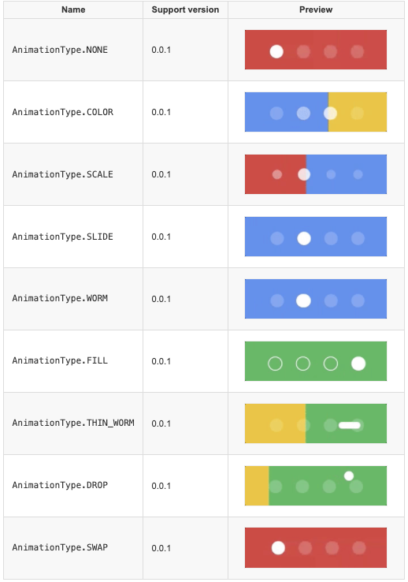

# MyAndroid

#### 介绍
Android开发组件和模块功能DEMO，干货满满。拿来即用


#### 软件架构
1.  app模块为DEMOs集
2.  每个XXDemo对应一个XX库模块


#### 安装教程

1.  git clone https://gitee.com/lc951/my-android.git


#### 使用说明

1.  IDE:Android studio 构建
2.  如果xxx库满足需要即可import module 选中目标xxx库目录即可导入到自己工程
3.  如有问题请提交wiki里

#### 1、轮播图1


参考代码示例如下：

```
        
        ImageView iv1 = (ImageView) LayoutInflater.from(this).inflate(R.layout.banner_item,bannerViewPager,false);
        ImageView iv2 = (ImageView) LayoutInflater.from(this).inflate(R.layout.banner_item,bannerViewPager,false);
        ImageView iv3 = (ImageView) LayoutInflater.from(this).inflate(R.layout.banner_item,bannerViewPager,false);
        ImageView iv4 = (ImageView) LayoutInflater.from(this).inflate(R.layout.banner_item,bannerViewPager,false);
        ImageView iv5 = (ImageView) LayoutInflater.from(this).inflate(R.layout.banner_item,bannerViewPager,false);
        final ImageView iv6 = (ImageView) LayoutInflater.from(this).inflate(R.layout.banner_item,bannerViewPager,false);

        iv1.setImageResource(R.mipmap.ic_img01);
        iv2.setImageResource(R.mipmap.ic_img02);
        iv3.setImageResource(R.mipmap.ic_img03);
        iv4.setImageResource(R.mipmap.ic_img04);
        iv5.setImageResource(R.mipmap.ic_img05);
        iv6.setImageResource(R.mipmap.ic_img06);

        //一开始只添加5个Item
        final List<ImageView> mViews = new ArrayList<>();
        mViews.add(iv1);
        mViews.add(iv2);
        mViews.add(iv3);
        mViews.add(iv4);
        mViews.add(iv5);
        
        bannerViewPager = findViewById(R.id.banner);

        ViewPagerAdapter  mAdapter = new ViewPagerAdapter(mViews, new OnPageClickListener() {
            @Override
            public void onPageClick(View view, int position) {
                Log.d("cylog","position:"+position);
            }
        });
        bannerViewPager.setAdapter(mAdapter);

```

##### 轮播图2 BannerViewPagerDemo2

优雅的实现手动滑到最后一页再向后滑动回到第一页

```
int scrollState = ViewPager.SCROLL_STATE_IDLE;
    private int lastValue = -1;
    private boolean canMove = true;
    ViewPager.OnPageChangeListener onPageChangeListener = new ViewPager.OnPageChangeListener() {
        @Override
        public void onPageScrolled(int position, float positionOffset, int positionOffsetPixels) {
            Log.i(TAG, "position=" + position + ",positionOffset=" + positionOffset + " ,positionOffsetPixels=" + positionOffsetPixels);
            if (scrollState == ViewPager.SCROLL_STATE_DRAGGING) {
                if (lastValue > positionOffsetPixels) {
                    Log.d(TAG, "向右滑动");
                } else if (lastValue < positionOffsetPixels) {
                    Log.d(TAG, "向左滑动");
                } else {
                    Log.e(TAG, "暂无法判断滑动方向");
                }
                if (0.0f == positionOffset && 0 == positionOffsetPixels) {
                    canMove = false;
                } else {
                    canMove = true;
                }
            }
            lastValue = positionOffsetPixels;
        }

        @Override
        public void onPageSelected(int i) {
            Log.d(TAG, "onPageSelected index=" + i);
            setSelectedIndicator(i);
        }

        @Override
        public void onPageScrollStateChanged(int i) {
            Log.d(TAG, "onPageScrollStateChanged i=" + i);

            if (ViewPager.SCROLL_STATE_DRAGGING == scrollState
                    && i == ViewPager.SCROLL_STATE_IDLE
                    && !canMove
            ) {
                if ( 0==viewPager.getCurrentItem() ) {
                    Log.d(TAG, "已在第一页了" + viewPager.getCurrentItem());
                }else{
                    Log.d(TAG, "已在最后一页了" + viewPager.getCurrentItem());
                    viewPager.setCurrentItem(0);
                }
            }
            scrollState = i;
        }
    };    
```
滑动到第一页或者最后一页 滑动参数

position=0,positionOffset=0.0 ,positionOffsetPixels=0

position=4,positionOffset=0.0 ,positionOffsetPixels=0

一共4页

过程中判断是从ViewPager.SCROLL_STATE_DRAGGING滑动到停止滑动ViewPager.SCROLL_STATE_IDLE，在状态还保存为ViewPager.SCROLL_STATE_DRAGGING依据canMove滑动标识为停止。 接着判断当前的页数在第一还是最后一页来判断。


#### 2、多功能指示器



xml：

```
<com.example.indicatorlib.views.PageIndicatorView
        android:id="@+id/pageIndicatorView"
        android:layout_width="wrap_content"
        android:layout_height="wrap_content"
        android:layout_alignParentBottom="true"
        android:layout_centerHorizontal="true"
        android:layout_marginBottom="48dp"
        app:layout_constraintTop_toBottomOf="@id/banner"
        app:layout_constraintLeft_toLeftOf="parent"
        app:layout_constraintRight_toRightOf="parent"
        attrs:piv_padding="12dp"
        attrs:piv_radius="8dp" />
 
```

java

```
 PageIndicatorView pageIndicatorView = findViewById(R.id.pageIndicatorView);
        pageIndicatorView.setViewPager(bannerViewPager.getViewPager());
        pageIndicatorView.setAnimationType(AnimationType.WORM);//动画效果设置

```


#### 参与贡献

1.  Fork 本仓库
2.  新建 Feat_xxx 分支
3.  提交代码
4.  新建 Pull Request


#### 特技

